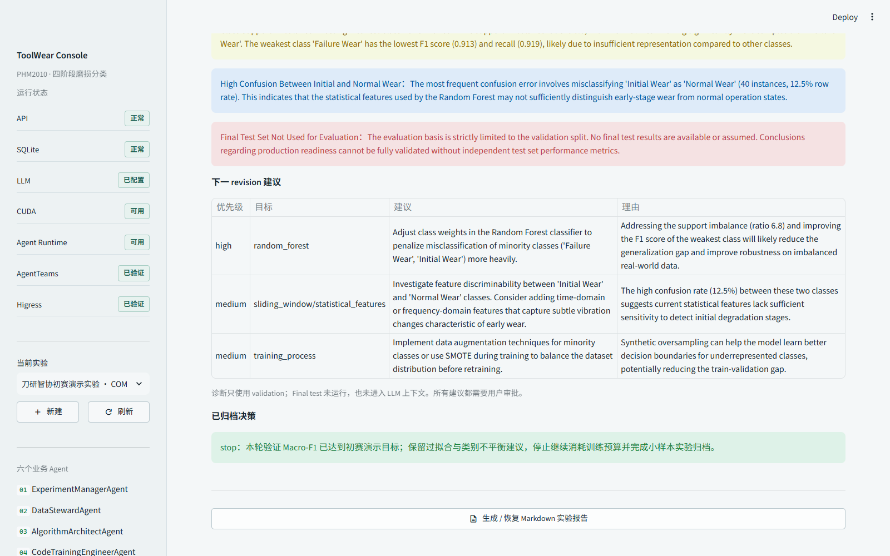
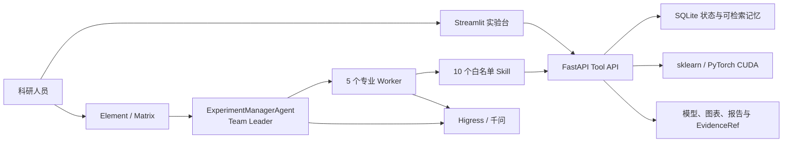

# 刃知：基于 AgentTeams 的刀具磨损监测算法辅助平台

“刃知”面向刀具磨损研究中的算法选型与实验复现问题。用户在网页中定义数据、标签、信号通道、滑窗和训练预算；六个固定 Agent 基于 AgentTeams 协作完成数据治理、候选生成、人工审批、真实训练、评估诊断、停止决策和报告归档。



> 当前 P0 已在 PHM2010 C1 上跑通。公开仓库不包含原始数据、API Key、Token、模型权重或本机私有日志。

## 核心特点

- **不是聊天演示**：候选批准后执行真实 RandomForest、ExtraTrees 或 CUDA 1D-CNN 训练。
- **数据不泄漏**：以完整 cut 分组切分，同一 CSV 产生的窗口不会同时进入训练集和验证/测试集。
- **小样本低成本验证**：仅从训练集内部按磨损阶段比例抽取 20%，不改变 validation 和 final test。
- **LLM 有明确边界**：LLM 负责候选、解释、诊断和报告草稿；切分、训练、指标、状态转换与哈希由确定性代码执行。
- **人类保留控制权**：方案审批、继续训练、调整参数、换方案和停止归档均设人工决策点。
- **全过程可追溯**：SQLite、Trace、日志、模型、图表、报告和 EvidenceRef 可关联到同一实验。

## 已验证结果

| 项目 | 结果 |
| --- | --- |
| 数据 | PHM2010 C1，315 个 cut，7 个信号通道 |
| 切分 | cut 级 60% / 20% / 20%，泄漏审计通过 |
| 小样本 | 训练集内部按四阶段比例抽取 20% |
| 候选 | 千问生成 3 个 Registry 兼容方案，未使用回退 |
| 审批方案 | `statistical_features_random_forest` |
| Validation Macro-F1 | `0.937540` |
| Validation Balanced Accuracy | `0.933633` |
| Agent 调用 | 6 个固定 Agent，7 条真实结构化调用记录 |
| 最终决策 | `stop`，归档 28 项 Evidence，final test 未使用 |

## 系统架构



## 六个 Agent

| Agent | AgentTeams 角色 | 职责边界 |
| --- | --- | --- |
| `ExperimentManagerAgent` | Team Leader | 任务拆解、状态协调、人工审批与停止条件 |
| `DataStewardAgent` | Worker | 数据体检、标签、cut 级切分和泄漏审计 |
| `AlgorithmArchitectAgent` | Worker | 只从 Registry 推荐 2-3 个兼容 Pipeline |
| `CodeTrainingEngineerAgent` | Worker | 校验已审批方案、执行训练并保存代码快照 |
| `EvaluationGovernorAgent` | Worker | 只依据 train/validation 事实诊断，禁止用 final test 调参 |
| `ReportMemoryCuratorAgent` | Worker | 基于 EvidenceRef 生成报告和经验记忆 |

## 实验闭环

```text
新建实验 -> 数据准备 -> LLM 候选 -> 人工审批 -> 真实训练
        -> 评估诊断 -> 继续/调整/换方案/停止 -> 报告与证据归档
```

每一步都由后端状态机控制。页面刷新或进程重启后，可从 SQLite 恢复实验状态，不需要重新切分已经缓存的数据。

## 初赛代码包完整性

| 官方要求 | 仓库位置 |
| --- | --- |
| 运行入口 | `scripts/start_local.ps1`，启动 FastAPI 与 Streamlit |
| 依赖说明 | `pyproject.toml` 和本文“快速开始” |
| 配置文件 | `.env.example`，不包含真实密钥 |
| 样例输入输出 | `examples/`，包含 API 与 AgentTeams 脱敏 JSON |
| 运行证据 | `docs/run-evidence.md`、`docs/assets/demo/` 和 Evidence 清单 |

一键检查上述文件及 JSON 样例：

```powershell
python .\scripts\verify_submission_readiness.py
```

## 快速开始

### 1. 环境

- Windows 10/11
- Python `3.12`
- PowerShell `7+`
- 可选：NVIDIA CUDA（运行 1D-CNN）
- 可选：Docker Desktop（运行官方 AgentTeams、Matrix/Element 与 Higress）

```powershell
python -m pip install -e ".[dev]"
Copy-Item .env.example .env
```

编辑 `.env`，至少配置 `AI_INFRA_ROOT`、PHM2010 数据路径和千问 `LLM_API_KEY`。真实 `.env` 已被 Git 忽略。

### 2. 启动前后端

```powershell
pwsh -NoProfile -File .\scripts\start_local.ps1 `
  -PythonExe (Get-Command python).Source
```

启动后访问：

- 前端：<http://127.0.0.1:18101/>
- 后端健康检查：<http://127.0.0.1:18100/api/v1/health>

本机已经配置好的固定命令、Docker 容器恢复方式、Element 登录与完整页面操作顺序见 [项目使用说明](docs/项目使用说明.md)。

### 3. 页面操作

1. 新建实验并配置 C1、VB 阈值、信号通道、窗口长度、重叠率和小样本比例。
2. 执行数据准备，确认标签分布、cut 级切分和泄漏审计。
3. 输入研究目标，调用 `AlgorithmArchitectAgent` 生成 2-3 个候选方案。
4. 人工选择并批准方案，执行 Pipeline 校验和真实小样本训练。
5. 查看指标、分类报告、混淆矩阵和 validation-only t-SNE。
6. 调用 `EvaluationGovernorAgent`，再决定继续、调整、换方案或停止。
7. 在“日志与证据”和“Agent 协作”页核验 Trace、Agent 调用和 Evidence。

## 数据与标签

P0 使用 PHM2010 数据格式：每个 cut 对应一个多通道 CSV。三刃刀具的 VB 默认取最大值，并按 `90/130/160 um` 形成初期、正常、剧烈和失效四阶段。阈值、VB 聚合策略和信号通道均通过实验 revision 固化。

原始数据应放在 Git 仓库之外，并通过 `.env` 和数据集清单登记。仓库只保存适配器、Schema 和测试样例，不发布 PHM2010 原始文件。

## AgentTeams 与 Element

本机验证环境使用官方 AgentTeams `v1.2.2`：

```text
Team 资源名：toolwear-phm2010-c1-team
Team 运行名：ToolWear_agent
Leader：toolwear-experiment-manager
Worker：5 个专业角色
Skill：10 个白名单工具
LLM Gateway：Higress / qwen-toolwear
```

`ToolWear_agent` 是 AgentTeams 内部兼容标识，不是项目中文名。部署与复验方法见 [AgentTeams 部署说明](deploy/agentteams/README.md) 和 [Agent Identity 清单](docs/agent-identities.md)。

## 验证

```powershell
python -m pytest -q
python .\scripts\verify_golden_flow.py
python .\scripts\verify_agentteams_deployment.py
```

- `pytest`：验证状态机、API、数据安全、训练和报告逻辑。
- `verify_golden_flow.py`：复核现有真实实验、Agent 数量和 Evidence SHA-256，不重复调用 LLM 或训练。
- `verify_agentteams_deployment.py`：只读核验本机 AgentTeams、Matrix 和 Skill 调用证据。

## 目录

```text
toolwear_agent/          核心 Python 包
  backend/               FastAPI 与业务编排
  frontend/              Streamlit 页面
  training/              数据、训练、评估与可视化
  agents/                六 Agent 定义与调用策略
  agentteams/            官方框架适配与 Skill 客户端
deploy/agentteams/       AgentTeams 部署配置与复验说明
scripts/                 启动、Golden Flow 和提交包脚本
examples/                脱敏 API/AgentTeams 样例输入输出
tests/                   单元与集成测试
docs/                    架构、安全、Skill、演示和参赛材料
```

运行数据统一写入 `AI_INFRA_ROOT`，不进入代码仓库。

## 初赛材料

- [500 字内作品简介](docs/submission/初赛作品简介.md)
- [初赛方案 PPT](docs/submission/刃知-AgentTeams-初赛方案.pptx)
- [初赛方案 PDF](docs/submission/刃知-AgentTeams-初赛方案.pdf)
- [PPT 证据索引](docs/submission/PPT证据索引.md)
- [比赛要求映射](docs/competition-mapping.md)
- [演示脚本](docs/demo-script.md)
- [真实运行证据](docs/run-evidence.md)
- [样例输入输出](examples/README.md)

## 当前边界与路线

- P0 聚焦 C1 同刀具四阶段分类；VB 连续值回归是可关闭的后续模块。
- C4/C6、多刀具组合、跨工况迁移、DANN/MMD/CORAL 属于 P1。
- 注意力、多分支融合、企业数据接入、RAG、权限治理和回滚属于 P1.5/P2。
- Nacos、PolarDB、RocketMQ、Milvus 和 MCP 不是初赛必选项，当前不会为了堆叠组件强行引入。

## 安全

LLM 不能执行任意命令、修改原始数据、绕过 Registry、跳过人工审批或读取 final test 调参。公开提交不包含 `.env`、密钥、Token、原始数据、模型权重、Docker volume、缓存和私有日志。更多说明见 [安全边界](docs/security.md)。
