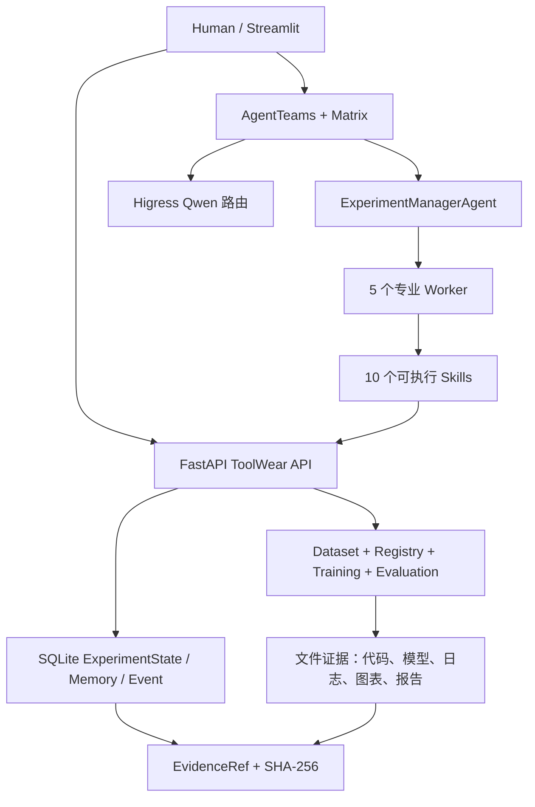

# 系统架构

## 设计目标

ToolWear AgentTeams 不是固定模型训练器，而是把多源状态监测算法研发过程组织成可交互、可恢复、可审批、可验证和可复用的多 Agent 闭环。LLM 负责判断与解释，确定性服务负责数据计算、训练和指标，任何结论都必须回到 EvidenceRef。



## 端到端状态流

```text
创建实验
-> DataSteward 数据体检、标签、cut 级切分
-> AlgorithmArchitect 生成 2-3 个候选
-> Human 批准 Pipeline
-> CodeTrainingEngineer 预检与真实训练
-> EvaluationGovernor validation 诊断与决策
-> Human 批准下一动作
-> ReportMemoryCurator 报告、Trace 和 Memory
```

## 数据与算法正确性

- 原始数据只读；数据集通过 `DatasetManifest/DatasetRef` 注册。
- 同一 cut 只能属于 train、validation 或 test 中的一个集合。
- 小样本在 train split 内按固定 seed、阶段、cut 和时间覆盖抽取。
- 候选排序、调参和停止决策只使用 train/validation。
- final test 只有 Pipeline 冻结后才允许执行，当前 Golden Flow 明确记录 `not_run_pipeline_not_frozen`。
- Pipeline 由统一 `PipelineSpec` 描述；Module/Trainer Registry 控制兼容性。

## 状态、证据与安全边界

- SQLite：实验、revision、审批、AgentTask/Result、Run、Decision、Evidence、Memory、幂等记录。
- 文件系统：配置、代码快照、模型、日志、指标、图表和 Markdown 报告。
- AgentTeams/Matrix：真实任务分派和 Worker 消息；ToolWear Event：业务状态与 Skill 执行事实。
- 同一 `correlation_id/trace_id/experiment_id` 关联两层证据。
- 所有 EvidenceRef 记录路径、类型、SHA-256 和生成主体；Golden Flow 会复算哈希。
- 不允许 Agent 执行任意 shell、访问白名单外主机/路径或绕过人工审批。

## P0 取舍

- 使用 SQLite + FTS5 实现轻量 Memory，不引入 Milvus。
- 复用 AgentTeams 的 Higress，不另建第二套网关。
- P0 不引入 Nacos、PolarDB、RocketMQ；已有 Registry、Repository 和事件接口为后续替换保留边界。
- P0 采用 HTTP/JSON 等价工具契约，后续迁移 MCP 只替换 transport 层。
